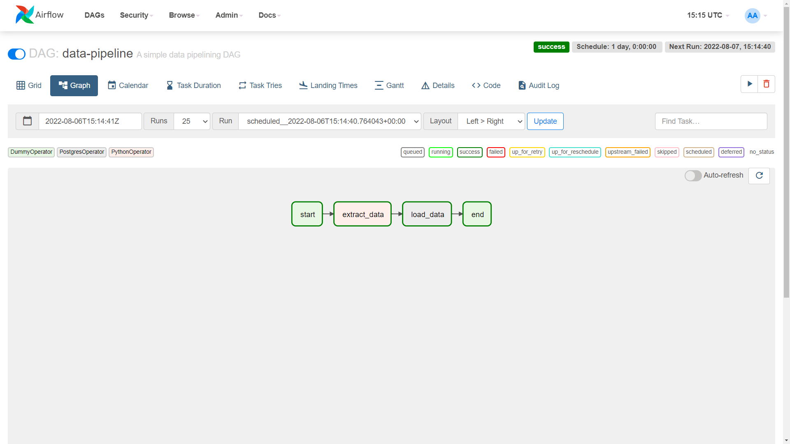

# glints-data-engineer-task
This is a home assignment task for Data Engineer role at Glints.

# Backgrounds
This repository is addressed as submissions of the [technical assignment](https://gist.github.com/seahyc/5b8d1fbc9126130520fcdb8b8e543198) for Data Engineer position at Glints. This repository contains a solution in maintaining the serviceability of Data Warehouse use case. Airflow is utilized as data pipeline orchestrator to extract data from Postgres datasource into target table in another Postgres database.

# Information
## a) Environments
* Linux environment (Ubuntu 20.04 LTS)
* Docker (version 20.10.17)

## b) Container services that'll be created
* Airflow Webserver (airflow-webserver)
* Airflow Scheduler (airflow-scheduler)
* Airflow Postgres Database (postgres)
* Source Postgres Database (postgres_src)
* Target Postgres Database (postgres_dst)

## c) Credentials and additional information
Airflow

    Airflow username: airflow
    Airflow password: airflow

Source Postgres Database

    Source Postgres username: airflow
    Source Postgres password: airflow
    Source Postgres database: airflow
    Source Postgres table   : sales

Target Postgres Database

    Target Postgres username: airflow
    Target Postgres password: airflow
    Target Postgres database: airflow
    Target Postgres table   : sales

# How-to-Run
Before we can run the Airflow, we need to do some preparation.

## 1. Deploy containers
Deploy the docker containers by running code below.

    $ make start

This command will compose up the docker container, then deploy the necessary services. You should see the containers status like below.

    CONTAINER ID   IMAGE                  COMMAND                  CREATED         STATUS                   PORTS                              NAMES
    84e271291563   apache/airflow:2.3.0   "/usr/bin/dumb-init …"   2 minutes ago   Up 2 minutes (healthy)   0.0.0.0:5884->8080/tcp             airflow-webserver
    08618ce7794a   apache/airflow:2.3.0   "/usr/bin/dumb-init …"   2 minutes ago   Up 2 minutes             8080/tcp, 0.0.0.0:8793->8793/tcp   airflow-scheduler
    9bc3f7682fe2   postgres:13            "docker-entrypoint.s…"   3 minutes ago   Up 3 minutes (healthy)   5432/tcp                           postgres_src
    f59365d819ad   postgres:13            "docker-entrypoint.s…"   3 minutes ago   Up 3 minutes (healthy)   0.0.0.0:5434->5432/tcp             postgres
    a4b957de7db5   postgres:13            "docker-entrypoint.s…"   3 minutes ago   Up 3 minutes (healthy)   5432/tcp                           postgres_dst

## 2. Set up initial preparation
Set-up some initial preparation, such as table data source and airflow postgres connections.

    $ make setup

This command will set neccesary initialization in order to make the airflow data pipeline works automatically, such as:

### a) Setup the postgres database connection
This initial setup will create the airflow connection to the source database and target database.

-------------------------------------------------------

### b) Setup the source database data
This initial setup will store the csv data into the source database.

    id,quantity,price,date
    1,1,11,2019-09-01
    2,1,14,2019-09-02
    3,1,150,2019-09-03
    4,1,2,2019-09-04
    5,1,11,2019-09-05
    6,1,400,2019-09-06
    7,1,14,2019-09-07
    8,1,700,2019-09-08
    9,1,149,2019-09-12
    10,1,11,2019-09-13
    11,1,150,2019-09-14
    12,1,14,2019-09-15
    13,1,11,2019-09-16
    14,4,3,2019-09-17
    15,1,99,2019-09-18
    16,1,11,2019-09-22
    17,1,109,2019-09-23
    18,1,11,2019-09-24
    19,1,11,2019-09-25
    20,1,149,2019-09-27
    21,2,11,2019-09-29
    22,1,11,2019-09-30

## 3. Run the data pipeline
From here, we can start the extraction of the data source and load it into the target table.

### a) Open airflow dashboard
First, you need to go to http://localhost:5884/ to open the Airflow dashboard by using credential below.

    username: airflow
    password: airflow

-------------------------------------------------------

### b) Select 'data-pipeline' DAG
Then, activate the 'data-pipeline' dag by clicking the switch button. After that, open the dag.

-------------------------------------------------------

### c) Check the dag pipeline status
Now the source data has been extracted into the target table.

-------------------------------------------------------

## 4. Inspect the data output
When the data extraction is done, we can inspect the output data by running the code below.

    $ make inspect

We can inspect the output data that has been stored in the postgres target database with the expected output data as below.

     id | quantity | price |    date    
    ----+----------+-------+------------
      1 |        1 |    11 | 2019-09-01
      2 |        1 |    14 | 2019-09-02
      3 |        1 |   150 | 2019-09-03
      4 |        1 |     2 | 2019-09-04
      5 |        1 |    11 | 2019-09-05
      6 |        1 |   400 | 2019-09-06
      7 |        1 |    14 | 2019-09-07
      8 |        1 |   700 | 2019-09-08
      9 |        1 |   149 | 2019-09-12
     10 |        1 |    11 | 2019-09-13
     11 |        1 |   150 | 2019-09-14
     12 |        1 |    14 | 2019-09-15
     13 |        1 |    11 | 2019-09-16
     14 |        4 |     3 | 2019-09-17
     15 |        1 |    99 | 2019-09-18
     16 |        1 |    11 | 2019-09-22
     17 |        1 |   109 | 2019-09-23
     18 |        1 |    11 | 2019-09-24

You can inspect the content of Target Database Y manually as well by executing command below.

    $ docker exec -it postgres_dst psql -d airflow -U airflow

This command will refer you into the target postgres database interface. Then, you can inspect the content of the data by querying the data with the expected output as below.

    # SELECT * FROM sales;

    --------------------------------------------------

     id | quantity | price |    date    
    ----+----------+-------+------------
      1 |        1 |    11 | 2019-09-01
      2 |        1 |    14 | 2019-09-02
      3 |        1 |   150 | 2019-09-03
      4 |        1 |     2 | 2019-09-04
      5 |        1 |    11 | 2019-09-05
      6 |        1 |   400 | 2019-09-06
      7 |        1 |    14 | 2019-09-07
      8 |        1 |   700 | 2019-09-08
      9 |        1 |   149 | 2019-09-12
     10 |        1 |    11 | 2019-09-13
     11 |        1 |   150 | 2019-09-14
     12 |        1 |    14 | 2019-09-15
     13 |        1 |    11 | 2019-09-16
     14 |        4 |     3 | 2019-09-17
     15 |        1 |    99 | 2019-09-18
     16 |        1 |    11 | 2019-09-22
     17 |        1 |   109 | 2019-09-23
     18 |        1 |    11 | 2019-09-24

## 5. Stop the services
After everything is done, we can shut down our services by executing the code below.

    $ make stop